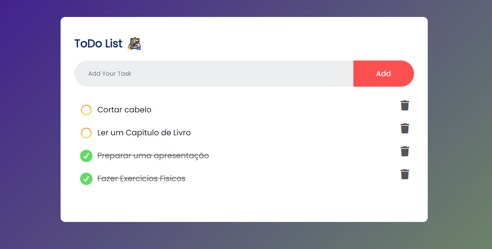

#  To-Do List Web App Front-End

<!-- TABLE OF CONTENTS -->

## Table of Contents

- [:notebook_with_decorative_cover:About the project](#notebook_with_decorative_coverabout-the-project)
  - [🛠️Technologies](#🛠️technologies)
- [:book:General instructions](#bookgeneral-instructions)
  - [:electric_plug:Installation](#electric_pluginstallation)
- [:book:Usage Examples](#bookusage-examples)
- [:technologist:Developer](#technologistdeveloper)

<!-- ABOUT THE PROJECT -->

## :notebook_with_decorative_cover:About the project

Welcome to our To-Do List Web App project! This simple and intuitive web application provides users with a clean interface to manage their tasks efficiently. Built with HTML, CSS, and JavaScript, our front-end implementation allows users to seamlessly add, delete, and mark tasks as checked.

Feel free to explore the codebase, customize it according to your preferences, or integrate it with your existing projects.

We hope you find our To-Do List Web App helpful in managing your tasks efficiently! If you have any suggestions or issues, please feel free to open an issue.

Happy task management! 📋✅

### 🛠️Technologies

<ul>
  <li><strong>HTML:</strong> Provides the structure and layout of the web page.</li>
  <li><strong>CSS:</strong> Styles the elements, making the user interface visually appealing.</li>
  <li><strong>JavaScript:</strong> Implements the dynamic behavior of the To-Do List, handling task addition, deletion, and checking functionalities.</li>
</ul>

## :book:General instructions

To use the To-Do List Web App, simply open the index.html file in your preferred web browser. No additional setup or installation is required.

### :electric_plug:Installation

1. Clone the repo

```sh
   git clone git@github.com:ANNEBORTOLI/puc-sprint1-frontend.git
   cd puc-sprint1-frontend
```

2. Open index.html in your browser.

## :camera_flash:Usage Examples

<div align="center">
  
</div>
<br>

## :technologist:Developer

- [Github](https://github.com/ANNEBORTOLI)
- [Linkedin](https://www.linkedin.com/in/anne-bortoli/)
